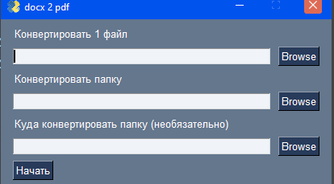

# FromDocToPdfWithGUI

Этот инструмент помогает конвертировать doc/docx файлы в pdf папкой или одним файлом

# Для чего это было создано?
1. На практике необходимо было создавать pdf файлы к каждому doc файлу.
2. Конвертировать каждый файл в ручную - гиблое дело.
3. Поэтому была создана программа по автоматизации этого труда.
4. Поэтому пользуйтесь на здоровье.
5. Если очень выручил - можете поставить звездочку ;)
# Установка:
1. Клонировать репозиторий.
2. Установить библиотеки docx2pdf и PySimpleGUI (в pycharm alt+enter по не достоющим файлам)
3. Запустить (я запускал на питоне 3.6)
4. Программа не зависает во время конвертации - она прогружает файлы
____

## Как выглядит программа

### EXE файл

1. Я пытался создать exe файл, но почему-то с библиотекой по конвертированию он не создается
2. Если у вас получилось собрать рабочий exe файл, прошу связаться со мной
